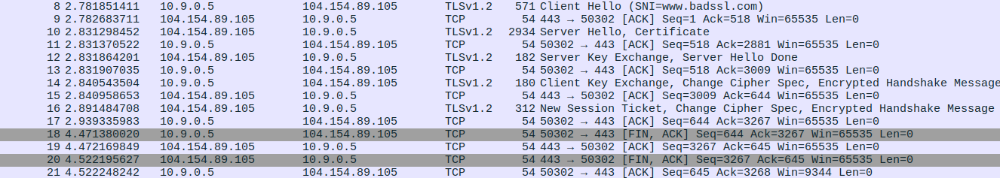
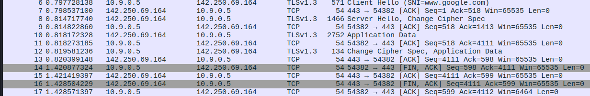
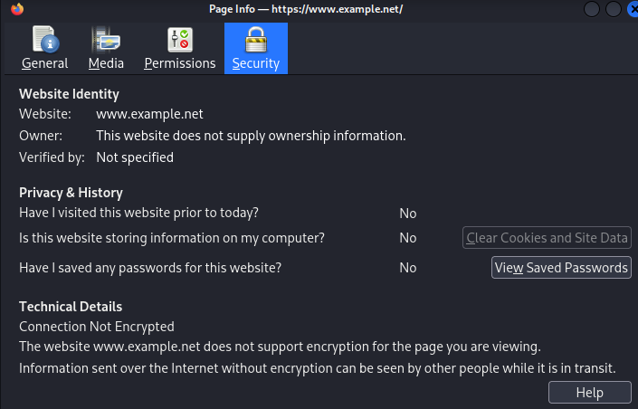
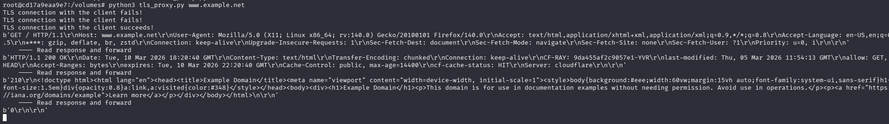

1. 
**TLS 1.2**

**TLS 1.3**

2. It is used for authenticating the key exchange, the public key is used to prove that the "secret" currently being negotiated is actually coming from the legitimate server and not an interceptor.

3. `cadir = '/etc/ssl/certs` is the directory that contains a collection of public certificates from the trusted CAs

4. 
TLS 1.2: Take 2 rounds of handshakes 
TLS1.3: Take 1 round of handshakes
5. 
6. 
