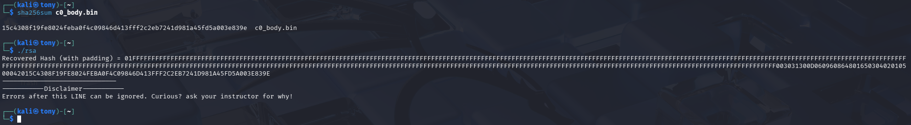

1. 
```
   issuer=C=US, O=DigiCert Inc, CN=DigiCert Global G2 TLS RSA SHA256 2020 CA1
```
2. 
```
01FFFFFFFFFFFFFFFFFFFFFFFFFFFFFFFFFFFFFFFFFFFFFFFFFFFFFFFFFFFFFFFFFFFFFFFFFFFFFFFFFFFFFFFFFFFFFFFFFFFFFFFFFFFFFFFFFFFFFFFFFFFFFFFFFFFFFFFFFFFFFFFFFFFFFFFFFFFFFFFFFFFFFFFFFFFFFFFFFFFFFFFFFFFFFFFFFFFFFFFFFFFFFFFFFFFFFFFFFFFFFFFFFFFFFFFFFFFFFFFFFFFFFFFFFFFFFFFFFFFFFFFFFFFFFFFFFFFFFFFFFFFFFFFFFFFFFFFFFFFFFFFFFFFFFFFFFFFFFFFFFFFFFFFFFFFFFFFFFFFFFFFFFFFFFFFFFFFFFFFFFFFFFFFFFFFFFFFFFFFFFFFFFFFFFFFFFFFFFFFFFFFF003031300D06096086480165030402010500042015C4308F19FE8024FEBA0F4C09846D413FFF2C2EB7241D981A45FD5A003E839E
```
3. 
4. 
- **Subject:** The entity being identified (e.g., `www.bcit.ca`).  
- **Public Key:** The RSA key used for encryption/verification.
- **Issuer:** The CA that signed the certificate.
- **Validity Period:** Not Before and Not After dates.
- **Serial Number:** A unique identifier from the CA.
- **Extensions:** Usage constraints (e.g., "Server Authentication") and Subject Alternative Names (SAN).
- **Signature Algorithm:** (e.g., `sha256WithRSAEncryption`).

3. **Extract the Body:** Obtain the TBS (To-Be-Signed) portion of the certificate.
4. **Hash the Body:** Use the specified algorithm (SHA-256) to create a digest of that body.
5. **Get the Signer's Public Key:** Obtain the public key (e,n) from the issuer's certificate.
6. **Decrypt the Signature:** Use the public key to decrypt the signature attached to the original certificate.
7. **Compare:** Verify that the decrypted hash matches the hash you calculated in Step 2.
8. **Check Constraints:** Ensure the current date is within the validity period and the certificate has not been revoked.