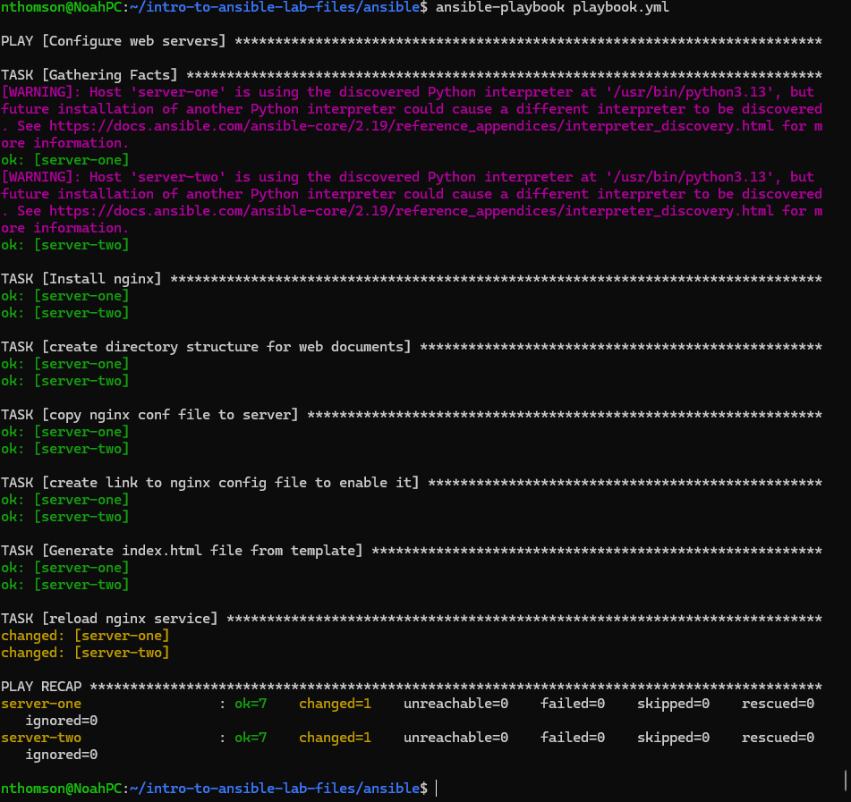

##### Tony Chou A01373832
##### Noah Thomson A01276533

### Setup
1. Generate SSH key
```bash
ssh-keygen -t ed25519 -f ~/.ssh/aws
./scripts/import_lab_key ~/.ssh/aws.pub
```

2. init  Terraform and apply
```bash
terraform init
terraform fmt
terraform validate
terraform plan -out lab
terraform apply
```

3. Update the `playbook.yml` and run the following command
```
ansible-playbook playbook.yml --syntax-check
ansible-playbook playbook.yml
```



#### Explanation

``` yaml
- name: Configure web servers

  hosts: all # Selects all hosts in inventory

  become: yes # Become SUDO (elevated)

  tasks:

    - name: Install nginx

      ansible.builtin.package:

        name: nginx # Specifies nginx package

        state: present # Specfies to install

        update_cache: yes # Essentially sudo apt update -y

    - name: create directory structure for web documents

      ansible.builtin.file:

        path: /web/html

        state: directory

        recurse: yes # Creates all directories in path (-p), since we're created nested

```

```

      ansible.builtin.file:

        src: /etc/nginx/sites-available/default

        dest: /etc/nginx/sites-enabled/default

        state: link # Creates a symbolic link file

```

```

    - name: reload nginx service

      ansible.builtin.service:

        name: nginx

        state: reloaded # Restart service

        enabled: yes # Enable service on startup
```
### Cleanup

1. 
 ```
   terraform destroy
   ```